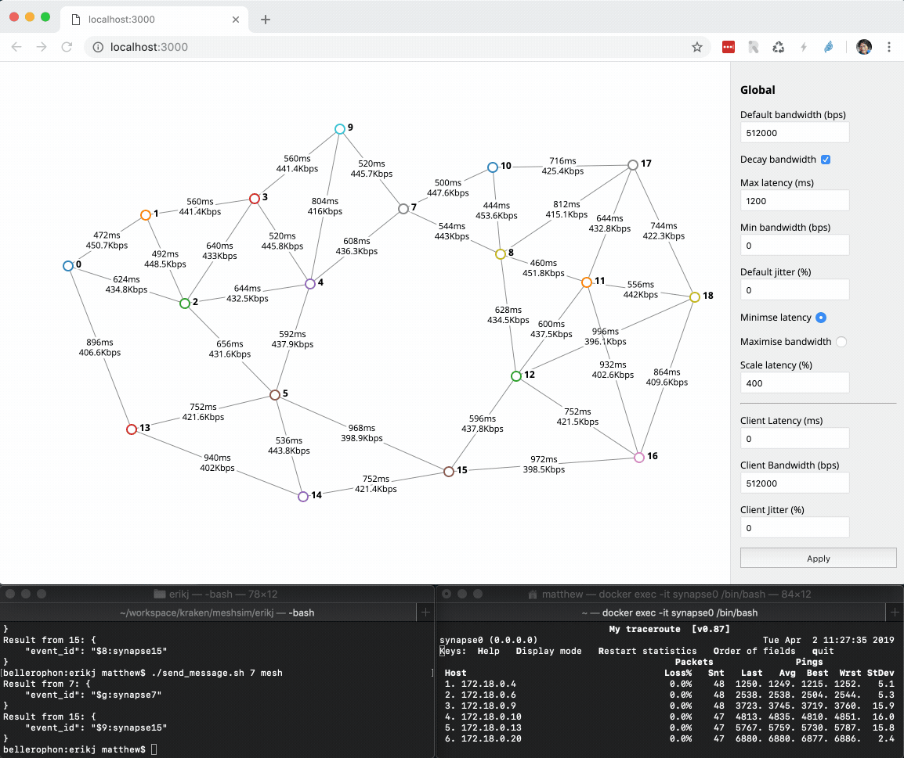

### Simulates a mesh of homeservers with Docker.



Meshsim lets you define and manage an arbitrary network of Matrix homeservers
in docker containers via a web interface.  Servers are instantiated by clicking
on the canvas, and the network topology and latency may be adjusted by dragging
servers around.  Servers connect to the nearest 5 nodes within the given latency
threshold.

The bandwidth and latency of individual network links can be overridden by clicking
on the link (which will turn red) and adjusting the specific values.

Traffic on the network is visualised in realtime by having servers
emit telemetry to the simulator via websocket, showing which events are emitted
and received from which server via which network link.  Events are shown as
animated circles which follow the network links between servers.  When a server
processes an inbound event, it shows an animation of the event expanding and popping
like a bubble.

The default docker image that meshsim launches is https://github.com/matrix-org/meshsim-docker
which provides both a Synapse and a [coap-proxy](https://github.com/matrix-org/coap-proxy)
for low-bandwidth Matrix transport experimentation.

Further details can be found in our FOSDEM 2019 talk about meshsim and coap-proxy at:
https://matrix.org/blog/2019/03/12/breaking-the-100bps-barrier-with-matrix-meshsim-coap-proxy/

#### Notes

 * Requires a HS with a Dockerfile which lets it be run in a Debianish container to support KSM.
 * Uses KSM to share memory between the server containers.
 * Uses a local postgres shared across all the servers as their DB for simplicity.
 * Uses Flask and NetworkX to model the network topology in python.
   * It puppets the dockerized HSes via `docker run` and talking HTTP to a `topologiser` daemon that runs on the container.
   * We deliberately use this rather than docker-compose or docker stack/swarm given the meshsim itself is acting as an orchestrator.
 * Uses D3 to visualise and control the network topology in browser.
 * Manually puppets the routing tables of the servers based on running dijkstra on the network topo
 * Manually puppets TC on the servers to cripple bandwidth, latency & jitter as desired.
   * Rather than forcing docker to spin up multiple interfaces per host (which would require gutwrenching the docker's network namespaces), we instead cripple bandwidth on egress traffic per upstream router (as identified by its MAC).

Now usable in general, but may be a bit fiddly to get up and running.

#### Installation

 * Supported on macOS (with Docker-for-mac 18.06, not 2.0) & Linux

 * Meshsim requires an up-to-date python installation of at least python 3.6
   * Check with `python --version` and/or `python3 --version`
   * Install python dependencies with `pip install -r requirements.txt` or `pip3 install -r requirements.txt`

 * Install Docker from docker.com (needs API 1.38; API 1.2x is known not to work.).
   * Check the API with `docker version`.
   * Your OS packages will probably be too old.

 * create a docker network: `docker network create --driver bridge mesh`. Later
   we will need to know the gateway IP (so that the images can talk to postgres,
   meshsim, etc on the host). On MacOS `host.docker.internal` will work,
   otherwise run `docker network inspect mesh` and find the Gateway IP.

 * Install postgres
   * `createuser -P synapse` # password synapseftw
   * edit postgresql.conf to ensure postgres is listening on an IP that docker
     containers will be able to hit. Set `listen_addresses = '<bridge ip>,localhost'`,
     although that will only work after step "create a docker network".
     If you can't find the config file, have a look in `/var/lib/pgsql/data/`.
   * edit pg_hba.conf to ensure connections from docker container IPs will be
     allowed (e.g. by enabling `trust` for user `synapse`). Example:

```
# Add the following to the end of the file
local   all             synapse                                 trust
host    all             all             YOUR_DOCKER_HOST_IP/16  trust
```

   * Recommended: It's worth making the user you plan to run meshsim a superuser
   in postgres, such that commands do not need to be prefixed with `sudo -u postgres`.
   You can do so with the following:

   ```
   sudo -u postgres createuser --superuser --no-password user
   ```

 * Optional: Enable KSM on your host so your synapses can deduplicate RAM
   as much as possible

 ```sh
screen ~/Library/Containers/com.docker.docker/Data/vms/0/tty  # on Docker-for-Mac
echo 1 > /sys/kernel/mm/ksm/run
echo 10000 > /sys/kernel/mm/ksm/pages_to_scan # 40MB of pages at a time

# check to see if it's working (will only kick in once you start running something which requests KSM, like our KSMified synapse)
grep -H '' /sys/kernel/mm/ksm/run/*
```

 * create a empty directory, e.g. `matrix-low-bandwidth`

 * check out meshsim
```
matrix-low-bandwidth$ git clone https://github.com/matrix-org/meshsim.git
```

 * Build the (KSM-capable) docker image:
   * Clone `synapse` repo and checkout the `babolivier/low-bandwidth` branch (inside the `matrix-low-bandwidth` directory)
```
matrix-low-bandwidth$ git clone https://github.com/matrix-org/synapse.git
matrix-low-bandwidth$ cd synapse
synapse$ git checkout babolivier/low-bandwidth
```

   * Clone the `meshsim-docker` repo (inside the `matrix-low-bandwidth` directory)
```
matrix-low-bandwidth$ git clone https://github.com/matrix-org/meshsim-docker.git
```

   * Run `docker build -t synapse -f meshsim-docker/Dockerfile .` from the top of the
     `matrix-low-bandwidth` directory (***not*** inside the `synapse` repo)

 * Install dependencies for meshsim (requires py3)
```
matrix-low-bandwidth$ cd meshsim
matrix-low-bandwidth$ pip3 install networkx quart aiohttp flask tenacity
```

 * Optionally edit `start_hs.sh` to add bind mount to a local working copy of
   synapse. This allows doing synapse dev without having to rebuild images. See
   `start_hs.sh` for details. An example of the `docker run` command in `start_hs.sh` is below:

```
docker run -d --name synapse$HSID \
	--privileged \
	--network mesh \
	--hostname synapse$HSID \
	-e SYNAPSE_SERVER_NAME=synapse${HSID} \
	-e SYNAPSE_REPORT_STATS=no \
	-e SYNAPSE_ENABLE_REGISTRATION=yes \
	-e SYNAPSE_LOG_LEVEL=INFO \
	-e POSTGRES_DB=synapse$HSID \
	-e POSTGRES_PASSWORD=synapseftw \
	-p $((18000 + HSID)):8008 \
	-p $((19000 + HSID)):3000 \
	-p $((20000 + HSID)):5683/udp \
	-e POSTGRES_HOST=$HOST_IP \
	-e SYNAPSE_LOG_HOST=$HOST_IP \
	-e SYNAPSE_USE_PROXY=1 \
	-e PROXY_DUMP_PAYLOADS=1 \
	--mount type=bind,source=/home/user/matrix-low-bandwidth/coap-proxy,destination=/proxy \
	--mount type=bind,source=/home/user/matrix-low-bandwidth/synapse/synapse,destination=/usr/local/lib/python3.7/site-packages/synapse \
	synapse
```

 * check you can start a synapse via `./start_hs.sh 1`, with the environment
   variable `POSTGRES_HOST` set to the docker network gateway IP (on MacOS
   `host.docker.internal` can be used)
    * If the template import fails with something about `en_GB`, make sure you have that locale generated. Replacing `en_GB` with `en_US` or whatever your locale is in `synapse_template.sql` is also sufficient.
 * check if it's running with `docker stats`
 * check the supervisor logs with `docker logs -f synapse1` and that it can talk to your postgres ok
 * log into the container to poke around with `docker exec -it synapse1 /bin/bash`
    * Actual synapse logs are located at `/var/log/supervisor/synapse*`

 * Check you can connect to its synapse at http://localhost:18001 (ports are 18000 + hsid).
   * Requires a Riot running on http on localhost or similar to support CORS to non-https
   * Initial user sign up may time out due to trying to connect to Riot-bot. Simply refresh the page and you should get in fine.
   * The KSM'd dockerfile autoprovisions an account on the HS called l/p matthew/secret for testing purposes.
 * Check that the topologiser is listening at http://localhost:19001 (ports are 19000 + hsid)
    * Don't expect to navigate to this URL and see anything more than a 404. As long as *something* is listening at this port, things are set up correctly.

 * shut it down nicely `./stop_clean_all.sh`

 * run meshsim:  `./meshsim.py <HOST_IP>` where `<HOST_IP>` is the docker
   network IP for the host (c.f. "create a docker network" step). Run
   `./meshsim.py -h` for more options.
 * connect to meshsim http://localhost:3000
 * click to create HSes
 * drag to move them around
 * => profit

You can log into the individual synapse containers as `docker exec -it synapse$N /bin/bash` to traceroute, ping
and generally see what see what's going on.

#### Using the CoAP proxy

* Check out the proxy in the `matrix-low-bandwidth` directory

```
matrix-low-bandwidth$ git checkout https://github.com/matrix-org/coap-proxy.git
matrix-low-bandwidth$ cd coap-proxy
```

* Build the proxy (see instruction in the [proxy's README](https://github.com/matrix-org/coap-proxy/blob/master/README.md))
* Run it by telling it to talk to the HS's proxy:

```bash
./bin/coap-proxy --coap-target localhost:20001 # Ports are 20000 + hsid
```

* Make clients talk to http://localhost:8888
* => profit

#### Limitations

Client-Server traffic shaping is only currently supported on macOS, as client->server traffic shaping
is currently implemented on the host (client) side.

#### License

Copyright 2019 New Vector Ltd

This file is part of meshsim.

meshsim is free software: you can redistribute it and/or modify
it under the terms of the GNU General Public License as published by
the Free Software Foundation, either version 3 of the License, or
(at your option) any later version.

meshsim is distributed in the hope that it will be useful,
but WITHOUT ANY WARRANTY; without even the implied warranty of
MERCHANTABILITY or FITNESS FOR A PARTICULAR PURPOSE.  See the
GNU General Public License for more details.

You should have received a copy of the GNU General Public License
along with meshsim.  If not, see <https://www.gnu.org/licenses/>.
